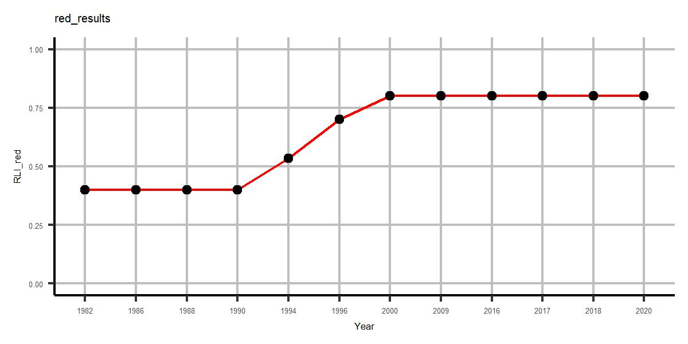

Este documento detalla la validación de los resultados para la estimación del Red List Index (RLI) realizada por el Instituto de Investigación de Recursos Biológicos Alexander von Humboldt (IAvH) en R software ([mbi-colombia/RLI](https://github.com/PEM-Humboldt/mbi-colombia/tree/main/MBI/BI_subindex/RLI), y [biab/RLI_pipeline](https://github.com/PEM-Humboldt/biab-2.0/tree/RLI_pipeline)). El RLI es un indicador que mide el riesgo de extinción de las especies a lo largo del tiempo, y su cálculo se basa en los cambios en las categorías de la Lista Roja de la UICN [(IUCN, 2024)](https://www.iucnredlist.org/assessment/red-list-index#:~:text=The%20Red%20List%20Index%20(RLI,targets%20for%20reducing%20biodiversity%20loss.). La validación se realizó revisando cada parte del código desarrollado por el IAvH, desde la organización de los datos hasta la ejecución de la ecuación del indicador, contrastando tanto los resultados obtenidos a través de la librería red como mediante un proceso manual.

El ejemplo documentado estima el RLI para grupos taxonómicos de especies clasificados y evaluados por la IUCN, utilizando la API de la libreria ['rredlist IUCN' Red List Client](https://cran.r-project.org/web/packages/rredlist/index.html) para consultar sus bases de datos, y estimando el indice a través de la librería [red IUCN Redlisting Tools](https://cran.r-project.org/web/packages/red/index.html).

### Cargar librerias/paquetes necesarios para el análisis
```{r,  eval=F, echo=T, results='hide', warning= F, message = F}
# Load libraries ####
packages_list<- c("dplyr","terra","red", "rredlist","ggplot2", "pbapply", "tibble", "plyr", "ggpubr")
packagesPrev<- .packages(all.available = TRUE)
lapply(packages_list, function(x) {   if ( ! x %in% packagesPrev ) { install.packages(x, force=T)}    })
lapply(packages_list, library, character.only = TRUE)
```

### Definir inputs
Los inputs del código son un token de acceso válido otorgado por la UICN (ej. `token= v11xxx22`), el nombre de un grupo taxonómico listado por la UICN (ej. `taxonomic_group= "crocodiles_and_alligators"`) y un año base de estimación para el cálculo del RLI desde ese momento hasta la actualidad (ej. `ano_base<- 2000`).

```{r,  eval=F, echo=T, results='hide', warning= F, message = F}
# Define inputs ####
##  IUCN token ####
token <- "v11xxx22"
taxonomic_group<- "crocodiles_and_alligators" # 
ano_base<- 2000 # año de inicio de estimación
```

### Check lista de datos por taxon 
```{r,  eval=F, echo=T, results='hide', warning= F, message = F}
IUCN_sp_Taxon <- rredlist::rl_comp_groups(group = taxonomic_group, key = token)$result
print(IUCN_sp_Taxon)
```

```{r,  eval= T, echo=F, warning= F, message = F, attr.output='style="max-height: 10px;"'}
IUCN_sp_Taxon<- openxlsx::read.xlsx( "C:/Users/Victor Julio/Documents/IUCN_sp_Taxon.xlsx" ) 
knitr::kable(IUCN_sp_Taxon)
```

### Obtener evaluacion historica de las especies listadas por taxon 
```{r,  eval=F, echo=T, results='hide', warning= F, message = F}
historyAssesment_data <- iucn_history_assessment_data <- pbapply::pblapply(IUCN_sp_Taxon[, "scientific_name"], function(x) {
  tryCatch({
    rredlist::rl_history(name = x, key = token)$result %>% dplyr::mutate(scientific_name= x) 
    }, error = function(e) {NULL})
}) %>% plyr::rbind.fill() %>% list(IUCN_sp_Taxon) %>% plyr::join_all(match = "first")
print(historyAssesment_data)
```

```{r,  eval= T, echo=F, warning= F, message = F, attr.output='style="max-height: 10px;"'}
historyAssesment_data<- openxlsx::read.xlsx( "C:/Users/Victor Julio/Documents/historyAssesment_data.xlsx" ) 
knitr::kable(historyAssesment_data)
```

### Ajustar como matriz ####
```{r,  eval=F, echo=T, results='hide', warning= F, message = F}
adjust_categories<- data.frame(Cat_IUCN= c("CR", NA, "EN", "EN", NA, NA, "LC", "LC", "LC", "NT",  "NT", "RE", "VU", "VU"),
                               code= c("CR", "DD", "E", "EN", "I", "K", "LC", "LR/cd", "LR/lc", "LR/nt",  "NT", "R", "V", "VU"))
print(adjust_categories)
```

### Corregir categorias ####
```{r,  eval= T, echo=F, warning= F, message = F, attr.output='style="max-height: 10px;"'}
## Corregir categorias ####
adjust_categories<- openxlsx::read.xlsx( "C:/Users/Victor Julio/Documents/adjust_categories.xlsx" ) 
knitr::kable(adjust_categories)
```

```{r,  eval=F, echo=T, results='hide', warning= F, message = F}
RedList_matrix<- historyAssesment_matrix %>% as.matrix()

for(i in seq(nrow(adjust_categories))){
  RedList_matrix[ which(RedList_matrix== adjust_categories[i,]$code, arr.ind = TRUE) ]<- adjust_categories[i,]$Cat_IUCN 
}

for(j in unique(adjust_categories$Cat_IUCN)){
  key<- c(tolower(j), toupper(j), j) %>% paste0(collapse = "|")
  RedList_matrix[ which(grepl(key, RedList_matrix), arr.ind = T) ]    <- j
}

RedList_matrix[which( (!RedList_matrix %in% adjust_categories$Cat_IUCN)  & !is.na(RedList_matrix) , arr.ind = TRUE )]<-NA
print(RedList_matrix)
```

```{r,  eval= T, echo=F, warning= F, message = F, attr.output='style="max-height: 10px;"'}
## Corregir categorias ####
RedList_matrix<- openxlsx::read.xlsx( "C:/Users/Victor Julio/Documents/RedList_matrix.xlsx" ) 
knitr::kable(RedList_matrix)
```

### Ajustar matriz
```{r,  eval=F, echo=T, results='hide', warning= F, message = F}
### Eliminar las especies que no aportan a la estimación. Menos de dos años con dato de categorización  ####
RedList_matrix_2<- RedList_matrix[rowSums(!is.na(RedList_matrix))>=2,]

### Asignar los años no evaluados NA con datos del año de ultima evaluacion ####
replace_na_with_previous <- function(df, target_col) {
  for (col in 2:(target_col-1)) {
    df[[target_col]] <- ifelse(is.na(df[[target_col]]), df[[col]], df[[target_col]])
  }; return(df) }

df = RedList_matrix_2 %>% as.data.frame.matrix()
for(k in 2:ncol(RedList_matrix_2)){ df <- replace_na_with_previous(df, k) }

### Eliminar las especies que no han sido evaluadas antes del año de base, en este caso input ano_base ####
base_year_index <- which(names(df) == as.character(ano_base))
df_clean <- df[!is.na(df[,base_year_index]),]
df_filtered <- df_clean %>% select(all_of(names(df_clean)[base_year_index:ncol(df_clean)]))


print(df_filtered)
```

```{r,  eval= T, echo=F, warning= F, message = F, attr.output='style="max-height: 10px;"'}
## Corregir categorias ####
df_filtered<- openxlsx::read.xlsx( "C:/Users/Victor Julio/Documents/df_filtered.xlsx" ) 
knitr::kable(df_filtered)
```

## Validación de resultados ####

Para validar los resultados obtenidos con el paquete red, primero ejecutamos la función red::rli, que calcula el Red List Index (RLI) de acuerdo con los datos proporcionados y los métodos implementados en dicho paquete. Posteriormente, estimamos manualmente el RLI utilizando la ecuación descrita por [Butchart et al. (2004, 2007)](https://journals.plos.org/plosone/article?id=10.1371/journal.pone.0000140), para verificar la coherencia entre ambos enfoques.


### Resultados de la libreria red ####

```{r,  eval=F, echo=T, results='hide', warning= F, message = F}
red_resuLt<- red::rli(df_filtered) %>% t() %>% as.data.frame() %>% tibble::rownames_to_column("Year") %>%  setNames(c("Year", "RLI_red")) %>% 
  dplyr::filter(!Year %in% "Change/year")

print(red_resuLt)
```

```{r,  eval= T, echo=F, warning= F, message = F, attr.output='style="max-height: 10px;"'}
## Corregir categorias ####
red_resuLt<- openxlsx::read.xlsx( "C:/Users/Victor Julio/Documents/red_resuLt.xlsx" ) 
knitr::kable(red_resuLt)
```

```{r,  eval=F, echo=T, results='hide', warning= F, message = F}
red_resuLt_plot<- ggplot(red_resuLt, aes(x = Year, y = RLI_red)) +
  geom_line(group = 1, col= "red") +
  geom_point() +
  coord_cartesian(ylim = c(0,1))+
  theme_classic()+
  theme(    panel.grid.major = element_line(color = "gray"),
  ) + theme(text = element_text(size = 4)) + ggtitle("red_results")

print(red_resuLt_plot)
```



### Resultados - ejecución manual (Butchart et al, 2004; 2007) 

N - numero de especies evaluadas = nrow(df_weights) calcula el número total de especies evaluadas, es decir, el número de filas en la matriz df_weights, que representa las especies y los pesos de las categorías de amenaza a lo largo del tiempo.
W - peso maximo = 5; Este valor de 5 se asigna al peso máximo para las especies, en este caso correspondiente a la categoría más alta de amenaza, que es "Extinto" (EX) o "En Peligro Crítico" (CR).
M= W*N= Puntaje máximo de amenaza

colSums(df_weights) suma los valores de los pesos de las categorías de amenaza para todas las especies en cada año de la forma ∑𝑊𝑐(𝑡,𝑠)

 El RLI se calcula usando la fórmula:
 
 
 


```{r,  eval=F, echo=T, results='hide', warning= F, message = F}
## Definir los pesos para cada categoría ####
category_weights <- c("LC" = 0, "NT" = 1, "VU" = 2, "EN" = 3, "CR" = 4, "DD" = NA)  # DD es NA porque no se incluye

### Reemplazar las categorías por sus pesos correspondientes ####
df_weights <- apply(df_filtered, 2, function(column) category_weights[column]) %>% as.data.frame.matrix() %>% 
  dplyr::mutate(ID_Fila= rownames(df_filtered)) %>% tibble::column_to_rownames(var = "ID_Fila")

print(df_weights)
```

```{r,  eval= T, echo=F, warning= F, message = F, attr.output='style="max-height: 10px;"'}
## Corregir categorias ####
df_weights<- openxlsx::read.xlsx( "C:/Users/Victor Julio/Documents/df_weights.xlsx" ) 
knitr::kable(df_weights)
```

```{r,  eval=F, echo=T, results='hide', warning= F, message = F}
### Ecuacion RLI Butchardt ####
#### Definir las variables de las ecuaciones ####
N= nrow(df_weights) # Numero de especies
W= 5 # peso maximo entre las especies evaluadas
M = W *N # Maximum threath score
Wc_ts<- colSums(df_weights) # Suma del peso de la categoría de amenaza c para la especie s en el tiempo t

#### Ejecutar ecuacion ####
RLI_Butchart_2007<-pblapply(Wc_ts, function(t) { (M-t)/M }) %>% unlist()
RLI_Butchart_2007

Butchart_result<- data.frame(Year= names(RLI_Butchart_2007), RLI_Butchart = (RLI_Butchart_2007))

print(RLI_Butchart)
```

```{r,  eval= T, echo=F, warning= F, message = F, attr.output='style="max-height: 10px;"'}
## Corregir categorias ####
Butchart_result<- openxlsx::read.xlsx( "C:/Users/Victor Julio/Documents/Butchart_result.xlsx" ) 
knitr::kable(Butchart_result)
```

```{r,  eval=F, echo=T, results='hide', warning= F, message = F}
Butchart_resuLt_plot<-  ggplot(Butchart_result, aes(x = Year, y = RLI_Butchart)) +
  geom_line(group = 1, col= "blue") +
  geom_point() +
  coord_cartesian(ylim = c(0,1))+
  theme_classic()+
  theme(    panel.grid.major = element_line(color = "gray"),
  ) + theme(text = element_text(size = 4)) + ggtitle("Butchart_result")

print(Butchart_resuLt_plot)
```


### Comparar resultados ####
```{r,  eval=F, echo=T, results='hide', warning= F, message = F}
compare_data<- list(red_resuLt, Butchart_result) %>% plyr::join_all()
print(compare_data)
```

```{r,  eval= T, echo=F, warning= F, message = F, attr.output='style="max-height: 10px;"'}
## Corregir categorias ####
compare_data<- openxlsx::read.xlsx( "C:/Users/Victor Julio/Documents/compare_data.xlsx" ) 
knitr::kable(compare_data)
```

```{r,  eval=F, echo=T, results='hide', warning= F, message = F}
compare_plot<- ggpubr::ggarrange(plotlist= list(red_resuLt_plot, Butchart_resuLt_plot), ncol= 2)
print(compare_plot)
```


