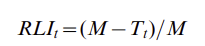
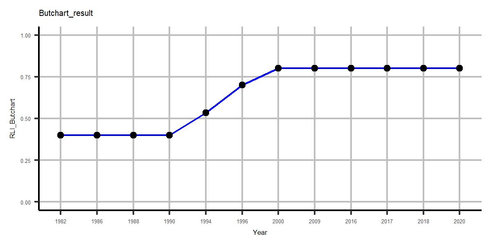
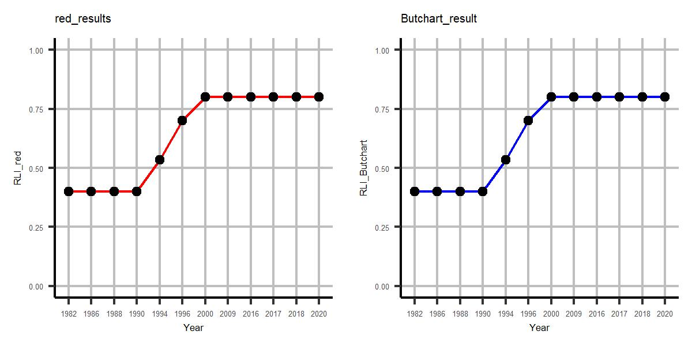

Validación RLI - IAvH
================
true

- [Cargar librerias/paquetes necesarios para el
  análisis](#cargar-libreriaspaquetes-necesarios-para-el-análisis)
- [Definir inputs](#definir-inputs)
- [Check lista de datos por taxon](#check-lista-de-datos-por-taxon)
- [Obtener evaluacion historica de las especies listadas por
  taxon](#obtener-evaluacion-historica-de-las-especies-listadas-por-taxon)
- [Ajustar como matriz](#ajustar-como-matriz)
- [Corregir categorias](#corregir-categorias)
- [Ajustar matriz](#ajustar-matriz)
- [Validación de resultados](#validación-de-resultados)
  - [Resultados de la libreria red](#resultados-de-la-libreria-red)
  - [Resultados - ejecución manual (Butchart et al, 2004;
    2007)](#resultados---ejecución-manual-butchart-et-al-2004-2007)
  - [Comparar resultados](#comparar-resultados)

Este documento detalla la validación de los resultados para la
estimación del Red List Index (RLI) realizada por el Instituto de
Investigación de Recursos Biológicos Alexander von Humboldt (IAvH) en R
software
([mbi-colombia/RLI](https://github.com/PEM-Humboldt/mbi-colombia/tree/main/MBI/BI_subindex/RLI),
y
[biab/RLI_pipeline](https://github.com/PEM-Humboldt/biab-2.0/tree/RLI_pipeline)).
El RLI es un indicador que mide el riesgo de extinción de las especies a
lo largo del tiempo, y su cálculo se basa en los cambios en las
categorías de la Lista Roja de la UICN \[(IUCN,
2024)\](<https://www.iucnredlist.org/assessment/red-list-index#>:~:text=The%20Red%20List%20Index%20(RLI,targets%20for%20reducing%20biodiversity%20loss.).
La validación se realizó revisando cada parte del código desarrollado
por el IAvH, desde la organización de los datos hasta la ejecución de la
ecuación del indicador, contrastando tanto los resultados obtenidos a
través de la librería red como mediante un proceso manual.

El ejemplo documentado estima el RLI para grupos taxonómicos de especies
clasificados y evaluados por la IUCN, utilizando la API de la libreria
[‘rredlist IUCN’ Red List
Client](https://cran.r-project.org/web/packages/rredlist/index.html)
para consultar sus bases de datos, y estimando el indice a través de la
librería [red IUCN Redlisting
Tools](https://cran.r-project.org/web/packages/red/index.html).

### Cargar librerias/paquetes necesarios para el análisis

``` r
# Load libraries ####
packages_list<- c("dplyr","terra","red", "rredlist","ggplot2", "pbapply", "tibble", "plyr", "ggpubr")
packagesPrev<- .packages(all.available = TRUE)
lapply(packages_list, function(x) {   if ( ! x %in% packagesPrev ) { install.packages(x, force=T)}    })
lapply(packages_list, library, character.only = TRUE)
```

### Definir inputs

Los inputs del código son un token de acceso válido otorgado por la UICN
(ej. `token= v11xxx22`), el nombre de un grupo taxonómico listado por la
UICN (ej. `taxonomic_group= "crocodiles_and_alligators"`) y un año base
de estimación para el cálculo del RLI desde ese momento hasta la
actualidad (ej. `ano_base<- 2000`).

``` r
# Define inputs ####
##  IUCN token ####
token <- "v11xxx22"
taxonomic_group<- "crocodiles_and_alligators" # 
ano_base<- 2000 # año de inicio de estimación
```

### Check lista de datos por taxon

``` r
IUCN_sp_Taxon <- rredlist::rl_comp_groups(group = taxonomic_group, key = token)$result
print(IUCN_sp_Taxon)
```

|  taxonid | scientific_name            | subspecies | rank | subpopulation | category |
|---------:|:---------------------------|-----------:|-----:|--------------:|:---------|
|    46583 | Alligator mississippiensis |         NA |   NA |            NA | LC       |
|      867 | Alligator sinensis         |         NA |   NA |            NA | CR       |
|    46584 | Caiman crocodilus          |         NA |   NA |            NA | LC       |
|    46585 | Caiman latirostris         |         NA |   NA |            NA | LC       |
|    46586 | Caiman yacare              |         NA |   NA |            NA | LC       |
|     5659 | Crocodylus acutus          |         NA |   NA |            NA | VU       |
|     5661 | Crocodylus intermedius     |         NA |   NA |            NA | CR       |
|    46589 | Crocodylus johnstoni       |         NA |   NA |            NA | LC       |
|     5672 | Crocodylus mindorensis     |         NA |   NA |            NA | CR       |
|     5663 | Crocodylus moreletii       |         NA |   NA |            NA | LC       |
| 45433088 | Crocodylus niloticus       |         NA |   NA |            NA | LC       |
|    46591 | Crocodylus novaeguineae    |         NA |   NA |            NA | LC       |
|     5667 | Crocodylus palustris       |         NA |   NA |            NA | VU       |
|     5668 | Crocodylus porosus         |         NA |   NA |            NA | LC       |
|     5670 | Crocodylus rhombifer       |         NA |   NA |            NA | CR       |
|     5671 | Crocodylus siamensis       |         NA |   NA |            NA | CR       |
|     8966 | Gavialis gangeticus        |         NA |   NA |            NA | CR       |
|     5660 | Mecistops cataphractus     |         NA |   NA |            NA | CR       |
|    13053 | Melanosuchus niger         |         NA |   NA |            NA | LR/cd    |
|    15635 | Osteolaemus tetraspis      |         NA |   NA |            NA | VU       |
|    46587 | Paleosuchus palpebrosus    |         NA |   NA |            NA | LC       |
|    46588 | Paleosuchus trigonatus     |         NA |   NA |            NA | LC       |
|    21981 | Tomistoma schlegelii       |         NA |   NA |            NA | EN       |

### Obtener evaluacion historica de las especies listadas por taxon

``` r
historyAssesment_data <- iucn_history_assessment_data <- pbapply::pblapply(IUCN_sp_Taxon[, "scientific_name"], function(x) {
  tryCatch({
    rredlist::rl_history(name = x, key = token)$result %>% dplyr::mutate(scientific_name= x) 
    }, error = function(e) {NULL})
}) %>% plyr::rbind.fill() %>% list(IUCN_sp_Taxon) %>% plyr::join_all(match = "first")
print(historyAssesment_data)
```

| category                          | scientific_name            | year | assess_year | code  | taxonid | subspecies | rank | subpopulation |
|:----------------------------------|:---------------------------|:-----|:------------|:------|--------:|-----------:|-----:|--------------:|
| Least Concern                     | Alligator mississippiensis | 2019 | 2018        | LC    |      NA |         NA |   NA |            NA |
| Lower Risk/least concern          | Alligator mississippiensis | 1996 | 1996        | LR/lc |      NA |         NA |   NA |            NA |
| Critically Endangered             | Alligator sinensis         | 2018 | 2017        | CR    |      NA |         NA |   NA |            NA |
| Critically Endangered             | Alligator sinensis         | 1996 | 1996        | CR    |      NA |         NA |   NA |            NA |
| Endangered                        | Alligator sinensis         | 1994 | 1994        | E     |      NA |         NA |   NA |            NA |
| Endangered                        | Alligator sinensis         | 1990 | 1990        | E     |      NA |         NA |   NA |            NA |
| Endangered                        | Alligator sinensis         | 1988 | 1988        | E     |      NA |         NA |   NA |            NA |
| Endangered                        | Alligator sinensis         | 1986 | 1986        | E     |      NA |         NA |   NA |            NA |
| Endangered                        | Alligator sinensis         | 1982 | 1982        | E     |      NA |         NA |   NA |            NA |
| Least Concern                     | Caiman crocodilus          | 2019 | 2016        | LC    |      NA |         NA |   NA |            NA |
| Lower Risk/least concern          | Caiman crocodilus          | 1996 | 1996        | LR/lc |      NA |         NA |   NA |            NA |
| Threatened                        | Caiman crocodilus          | 1988 | 1988        | T     |      NA |         NA |   NA |            NA |
| Threatened                        | Caiman crocodilus          | 1986 | 1986        | T     |      NA |         NA |   NA |            NA |
| Least Concern                     | Caiman latirostris         | 2020 | 2019        | LC    |      NA |         NA |   NA |            NA |
| Lower Risk/least concern          | Caiman latirostris         | 1996 | 1996        | LR/lc |      NA |         NA |   NA |            NA |
| Endangered                        | Caiman latirostris         | 1990 | 1990        | E     |      NA |         NA |   NA |            NA |
| Endangered                        | Caiman latirostris         | 1988 | 1988        | E     |      NA |         NA |   NA |            NA |
| Endangered                        | Caiman latirostris         | 1986 | 1986        | E     |      NA |         NA |   NA |            NA |
| Endangered                        | Caiman latirostris         | 1982 | 1982        | E     |      NA |         NA |   NA |            NA |
| Least Concern                     | Caiman yacare              | 2020 | 2019        | LC    |      NA |         NA |   NA |            NA |
| Lower Risk/least concern          | Caiman yacare              | 1996 | 1996        | LR/lc |      NA |         NA |   NA |            NA |
| Indeterminate                     | Caiman yacare              | 1982 | 1982        | I     |      NA |         NA |   NA |            NA |
| Vulnerable                        | Crocodylus acutus          | 2022 | 2020        | VU    |      NA |         NA |   NA |            NA |
| Vulnerable                        | Crocodylus acutus          | 2021 | 2020        | VU    |      NA |         NA |   NA |            NA |
| Vulnerable                        | Crocodylus acutus          | 2012 | 2009        | VU    |      NA |         NA |   NA |            NA |
| Vulnerable                        | Crocodylus acutus          | 1996 | 1996        | VU    |      NA |         NA |   NA |            NA |
| Vulnerable                        | Crocodylus acutus          | 1994 | 1994        | V     |      NA |         NA |   NA |            NA |
| Endangered                        | Crocodylus acutus          | 1990 | 1990        | E     |      NA |         NA |   NA |            NA |
| Endangered                        | Crocodylus acutus          | 1988 | 1988        | E     |      NA |         NA |   NA |            NA |
| Endangered                        | Crocodylus acutus          | 1986 | 1986        | E     |      NA |         NA |   NA |            NA |
| Endangered                        | Crocodylus acutus          | 1982 | 1982        | E     |      NA |         NA |   NA |            NA |
| Critically Endangered             | Crocodylus intermedius     | 2018 | 2017        | CR    |      NA |         NA |   NA |            NA |
| Critically Endangered             | Crocodylus intermedius     | 1996 | 1996        | CR    |      NA |         NA |   NA |            NA |
| Endangered                        | Crocodylus intermedius     | 1994 | 1994        | E     |      NA |         NA |   NA |            NA |
| Endangered                        | Crocodylus intermedius     | 1990 | 1990        | E     |      NA |         NA |   NA |            NA |
| Endangered                        | Crocodylus intermedius     | 1988 | 1988        | E     |      NA |         NA |   NA |            NA |
| Endangered                        | Crocodylus intermedius     | 1986 | 1986        | E     |      NA |         NA |   NA |            NA |
| Endangered                        | Crocodylus intermedius     | 1982 | 1982        | E     |      NA |         NA |   NA |            NA |
| Least Concern                     | Crocodylus johnstoni       | 2017 | 2016        | LC    |      NA |         NA |   NA |            NA |
| Lower Risk/least concern          | Crocodylus johnstoni       | 1996 | 1996        | LR/lc |      NA |         NA |   NA |            NA |
| Vulnerable                        | Crocodylus johnstoni       | 1988 | 1988        | V     |      NA |         NA |   NA |            NA |
| Vulnerable                        | Crocodylus johnstoni       | 1986 | 1986        | V     |      NA |         NA |   NA |            NA |
| Vulnerable                        | Crocodylus johnstoni       | 1982 | 1982        | V     |      NA |         NA |   NA |            NA |
| Critically Endangered             | Crocodylus mindorensis     | 2016 | 2012        | CR    |      NA |         NA |   NA |            NA |
| Critically Endangered             | Crocodylus mindorensis     | 1996 | 1996        | CR    |      NA |         NA |   NA |            NA |
| Endangered                        | Crocodylus mindorensis     | 1994 | 1994        | E     |      NA |         NA |   NA |            NA |
| Endangered                        | Crocodylus mindorensis     | 1990 | 1990        | E     |      NA |         NA |   NA |            NA |
| Endangered                        | Crocodylus mindorensis     | 1988 | 1988        | E     |      NA |         NA |   NA |            NA |
| Endangered                        | Crocodylus mindorensis     | 1986 | 1986        | E     |      NA |         NA |   NA |            NA |
| Endangered                        | Crocodylus mindorensis     | 1982 | 1982        | E     |      NA |         NA |   NA |            NA |
| Least Concern                     | Crocodylus moreletii       | 2023 | 2020        | LC    |      NA |         NA |   NA |            NA |
| Least Concern                     | Crocodylus moreletii       | 2012 | 2009        | LC    |      NA |         NA |   NA |            NA |
| Lower Risk/conservation dependent | Crocodylus moreletii       | 2000 | 2000        | LR/cd |      NA |         NA |   NA |            NA |
| Data Deficient                    | Crocodylus moreletii       | 1996 | 1996        | DD    |      NA |         NA |   NA |            NA |
| Endangered                        | Crocodylus moreletii       | 1990 | 1990        | E     |      NA |         NA |   NA |            NA |
| Endangered                        | Crocodylus moreletii       | 1988 | 1988        | E     |      NA |         NA |   NA |            NA |
| Endangered                        | Crocodylus moreletii       | 1986 | 1986        | E     |      NA |         NA |   NA |            NA |
| Endangered                        | Crocodylus moreletii       | 1982 | 1982        | E     |      NA |         NA |   NA |            NA |
| Least Concern                     | Crocodylus niloticus       | 2019 | 2017        | LC    |      NA |         NA |   NA |            NA |
| Least Concern                     | Crocodylus novaeguineae    | 2019 | 2018        | LC    |      NA |         NA |   NA |            NA |
| Lower Risk/least concern          | Crocodylus novaeguineae    | 1996 | 1996        | LR/lc |      NA |         NA |   NA |            NA |
| Vulnerable                        | Crocodylus novaeguineae    | 1988 | 1988        | V     |      NA |         NA |   NA |            NA |
| Vulnerable                        | Crocodylus novaeguineae    | 1986 | 1986        | V     |      NA |         NA |   NA |            NA |
| Vulnerable                        | Crocodylus novaeguineae    | 1982 | 1982        | V     |      NA |         NA |   NA |            NA |
| Vulnerable                        | Crocodylus palustris       | 2013 | 2009        | VU    |      NA |         NA |   NA |            NA |
| Vulnerable                        | Crocodylus palustris       | 1996 | 1996        | VU    |      NA |         NA |   NA |            NA |
| Vulnerable                        | Crocodylus palustris       | 1994 | 1994        | V     |      NA |         NA |   NA |            NA |
| Vulnerable                        | Crocodylus palustris       | 1990 | 1990        | V     |      NA |         NA |   NA |            NA |
| Vulnerable                        | Crocodylus palustris       | 1988 | 1988        | V     |      NA |         NA |   NA |            NA |
| Vulnerable                        | Crocodylus palustris       | 1986 | 1986        | V     |      NA |         NA |   NA |            NA |
| Vulnerable                        | Crocodylus palustris       | 1982 | 1982        | V     |      NA |         NA |   NA |            NA |
| Least Concern                     | Crocodylus porosus         | 2021 | 2019        | LC    |      NA |         NA |   NA |            NA |
| Lower Risk/least concern          | Crocodylus porosus         | 1996 | 1996        | LR/lc |      NA |         NA |   NA |            NA |
| Vulnerable                        | Crocodylus porosus         | 1994 | 1994        | V     |      NA |         NA |   NA |            NA |
| Vulnerable                        | Crocodylus porosus         | 1990 | 1990        | V     |      NA |         NA |   NA |            NA |
| Endangered                        | Crocodylus porosus         | 1988 | 1988        | E     |      NA |         NA |   NA |            NA |
| Endangered                        | Crocodylus porosus         | 1986 | 1986        | E     |      NA |         NA |   NA |            NA |
| Endangered                        | Crocodylus porosus         | 1982 | 1982        | E     |      NA |         NA |   NA |            NA |
| Critically Endangered             | Crocodylus rhombifer       | 2022 | 2022        | CR    |      NA |         NA |   NA |            NA |
| Critically Endangered             | Crocodylus rhombifer       | 2008 | 2008        | CR    |      NA |         NA |   NA |            NA |
| Endangered                        | Crocodylus rhombifer       | 1996 | 1996        | EN    |      NA |         NA |   NA |            NA |
| Endangered                        | Crocodylus rhombifer       | 1994 | 1994        | E     |      NA |         NA |   NA |            NA |
| Endangered                        | Crocodylus rhombifer       | 1990 | 1990        | E     |      NA |         NA |   NA |            NA |
| Endangered                        | Crocodylus rhombifer       | 1988 | 1988        | E     |      NA |         NA |   NA |            NA |
| Endangered                        | Crocodylus rhombifer       | 1986 | 1986        | E     |      NA |         NA |   NA |            NA |
| Endangered                        | Crocodylus rhombifer       | 1982 | 1982        | E     |      NA |         NA |   NA |            NA |
| Critically Endangered             | Crocodylus siamensis       | 2012 | 2012        | CR    |      NA |         NA |   NA |            NA |
| Critically Endangered             | Crocodylus siamensis       | 1996 | 1996        | CR    |      NA |         NA |   NA |            NA |
| Endangered                        | Crocodylus siamensis       | 1994 | 1994        | E     |      NA |         NA |   NA |            NA |
| Endangered                        | Crocodylus siamensis       | 1990 | 1990        | E     |      NA |         NA |   NA |            NA |
| Endangered                        | Crocodylus siamensis       | 1988 | 1988        | E     |      NA |         NA |   NA |            NA |
| Endangered                        | Crocodylus siamensis       | 1986 | 1986        | E     |      NA |         NA |   NA |            NA |
| Endangered                        | Crocodylus siamensis       | 1982 | 1982        | E     |      NA |         NA |   NA |            NA |
| Critically Endangered             | Gavialis gangeticus        | 2019 | 2017        | CR    |      NA |         NA |   NA |            NA |
| Critically Endangered             | Gavialis gangeticus        | 2007 | 2007        | CR    |      NA |         NA |   NA |            NA |
| Endangered                        | Gavialis gangeticus        | 1996 | 1996        | EN    |      NA |         NA |   NA |            NA |
| Endangered                        | Gavialis gangeticus        | 1994 | 1994        | E     |      NA |         NA |   NA |            NA |
| Endangered                        | Gavialis gangeticus        | 1990 | 1990        | E     |      NA |         NA |   NA |            NA |
| Endangered                        | Gavialis gangeticus        | 1988 | 1988        | E     |      NA |         NA |   NA |            NA |
| Endangered                        | Gavialis gangeticus        | 1986 | 1986        | E     |      NA |         NA |   NA |            NA |
| Endangered                        | Gavialis gangeticus        | 1982 | 1982        | E     |      NA |         NA |   NA |            NA |
| Critically Endangered             | Mecistops cataphractus     | 2014 | 2013        | CR    |      NA |         NA |   NA |            NA |
| Data Deficient                    | Mecistops cataphractus     | 1996 | 1996        | DD    |      NA |         NA |   NA |            NA |
| Vulnerable                        | Mecistops cataphractus     | 1994 | 1994        | V     |      NA |         NA |   NA |            NA |
| Indeterminate                     | Mecistops cataphractus     | 1990 | 1990        | I     |      NA |         NA |   NA |            NA |
| Indeterminate                     | Mecistops cataphractus     | 1988 | 1988        | I     |      NA |         NA |   NA |            NA |
| Indeterminate                     | Mecistops cataphractus     | 1986 | 1986        | I     |      NA |         NA |   NA |            NA |
| Indeterminate                     | Mecistops cataphractus     | 1982 | 1982        | I     |      NA |         NA |   NA |            NA |
| Lower Risk/conservation dependent | Melanosuchus niger         | 2000 | 2000        | LR/cd |      NA |         NA |   NA |            NA |
| Endangered                        | Melanosuchus niger         | 1996 | 1996        | EN    |      NA |         NA |   NA |            NA |
| Vulnerable                        | Melanosuchus niger         | 1994 | 1994        | V     |      NA |         NA |   NA |            NA |
| Endangered                        | Melanosuchus niger         | 1990 | 1990        | E     |      NA |         NA |   NA |            NA |
| Endangered                        | Melanosuchus niger         | 1988 | 1988        | E     |      NA |         NA |   NA |            NA |
| Endangered                        | Melanosuchus niger         | 1986 | 1986        | E     |      NA |         NA |   NA |            NA |
| Endangered                        | Melanosuchus niger         | 1982 | 1982        | E     |      NA |         NA |   NA |            NA |
| Vulnerable                        | Osteolaemus tetraspis      | 1996 | 1996        | VU    |      NA |         NA |   NA |            NA |
| Indeterminate                     | Osteolaemus tetraspis      | 1988 | 1988        | I     |      NA |         NA |   NA |            NA |
| Indeterminate                     | Osteolaemus tetraspis      | 1986 | 1986        | I     |      NA |         NA |   NA |            NA |
| Indeterminate                     | Osteolaemus tetraspis      | 1982 | 1982        | I     |      NA |         NA |   NA |            NA |
| Least Concern                     | Paleosuchus palpebrosus    | 2019 | 2018        | LC    |      NA |         NA |   NA |            NA |
| Lower Risk/least concern          | Paleosuchus palpebrosus    | 1996 | 1996        | LR/lc |      NA |         NA |   NA |            NA |
| Least Concern                     | Paleosuchus trigonatus     | 2019 | 2018        | LC    |      NA |         NA |   NA |            NA |
| Lower Risk/least concern          | Paleosuchus trigonatus     | 1996 | 1996        | LR/lc |      NA |         NA |   NA |            NA |
| Endangered                        | Tomistoma schlegelii       | 2023 | 2022        | EN    |      NA |         NA |   NA |            NA |
| Vulnerable                        | Tomistoma schlegelii       | 2014 | 2011        | VU    |      NA |         NA |   NA |            NA |
| Endangered                        | Tomistoma schlegelii       | 2000 | 2000        | EN    |      NA |         NA |   NA |            NA |
| Data Deficient                    | Tomistoma schlegelii       | 1996 | 1996        | DD    |      NA |         NA |   NA |            NA |
| Endangered                        | Tomistoma schlegelii       | 1994 | 1994        | E     |      NA |         NA |   NA |            NA |
| Endangered                        | Tomistoma schlegelii       | 1990 | 1990        | E     |      NA |         NA |   NA |            NA |
| Endangered                        | Tomistoma schlegelii       | 1988 | 1988        | E     |      NA |         NA |   NA |            NA |
| Endangered                        | Tomistoma schlegelii       | 1986 | 1986        | E     |      NA |         NA |   NA |            NA |
| Endangered                        | Tomistoma schlegelii       | 1982 | 1982        | E     |      NA |         NA |   NA |            NA |

### Ajustar como matriz

``` r
adjust_categories<- data.frame(Cat_IUCN= c("CR", NA, "EN", "EN", NA, NA, "LC", "LC", "LC", "NT",  "NT", "RE", "VU", "VU"),
                               code= c("CR", "DD", "E", "EN", "I", "K", "LC", "LR/cd", "LR/lc", "LR/nt",  "NT", "R", "V", "VU"))
print(adjust_categories)
```

### Corregir categorias

| Cat_IUCN | code  |
|:---------|:------|
| CR       | CR    |
| NA       | DD    |
| EN       | E     |
| EN       | EN    |
| NA       | I     |
| NA       | K     |
| LC       | LC    |
| LC       | LR/cd |
| LC       | LR/lc |
| NT       | LR/nt |
| NT       | NT    |
| RE       | R     |
| VU       | V     |
| VU       | VU    |

``` r
RedList_matrix<- historyAssesment_matrix %>% as.matrix()

for(i in seq(nrow(adjust_categories))){
  RedList_matrix[ which(RedList_matrix== adjust_categories[i,]$code, arr.ind = TRUE) ]<- adjust_categories[i,]$Cat_IUCN 
}

for(j in unique(adjust_categories$Cat_IUCN)){
  key<- c(tolower(j), toupper(j), j) %>% paste0(collapse = "|")
  RedList_matrix[ which(grepl(key, RedList_matrix), arr.ind = T) ]    <- j
}

RedList_matrix[which( (!RedList_matrix %in% adjust_categories$Cat_IUCN)  & !is.na(RedList_matrix) , arr.ind = TRUE )]<-NA
print(RedList_matrix)
```

| sp                         | 1982 | 1986 | 1988 | 1990 | 1994 | 1996 | 2000 | 2007 | 2008 | 2009 | 2011 | 2012 | 2013 | 2016 | 2017 | 2018 | 2019 | 2020 | 2022 |
|:---------------------------|:-----|:-----|:-----|:-----|:-----|:-----|:-----|:-----|:-----|:-----|:-----|:-----|:-----|:-----|:-----|:-----|:-----|:-----|:-----|
| Alligator mississippiensis | NA   | NA   | NA   | NA   | NA   | LC   | NA   | NA   | NA   | NA   | NA   | NA   | NA   | NA   | NA   | LC   | NA   | NA   | NA   |
| Alligator sinensis         | EN   | EN   | EN   | EN   | EN   | CR   | NA   | NA   | NA   | NA   | NA   | NA   | NA   | NA   | CR   | NA   | NA   | NA   | NA   |
| Caiman crocodilus          | NA   | NA   | NA   | NA   | NA   | LC   | NA   | NA   | NA   | NA   | NA   | NA   | NA   | LC   | NA   | NA   | NA   | NA   | NA   |
| Caiman latirostris         | EN   | EN   | EN   | EN   | NA   | LC   | NA   | NA   | NA   | NA   | NA   | NA   | NA   | NA   | NA   | NA   | LC   | NA   | NA   |
| Caiman yacare              | NA   | NA   | NA   | NA   | NA   | LC   | NA   | NA   | NA   | NA   | NA   | NA   | NA   | NA   | NA   | NA   | LC   | NA   | NA   |
| Crocodylus acutus          | EN   | EN   | EN   | EN   | VU   | VU   | NA   | NA   | NA   | VU   | NA   | NA   | NA   | NA   | NA   | NA   | NA   | VU   | NA   |
| Crocodylus intermedius     | EN   | EN   | EN   | EN   | EN   | CR   | NA   | NA   | NA   | NA   | NA   | NA   | NA   | NA   | CR   | NA   | NA   | NA   | NA   |
| Crocodylus johnstoni       | VU   | VU   | VU   | NA   | NA   | LC   | NA   | NA   | NA   | NA   | NA   | NA   | NA   | LC   | NA   | NA   | NA   | NA   | NA   |
| Crocodylus mindorensis     | EN   | EN   | EN   | EN   | EN   | CR   | NA   | NA   | NA   | NA   | NA   | CR   | NA   | NA   | NA   | NA   | NA   | NA   | NA   |
| Crocodylus moreletii       | EN   | EN   | EN   | EN   | NA   | NA   | LC   | NA   | NA   | LC   | NA   | NA   | NA   | NA   | NA   | NA   | NA   | LC   | NA   |
| Crocodylus niloticus       | NA   | NA   | NA   | NA   | NA   | NA   | NA   | NA   | NA   | NA   | NA   | NA   | NA   | NA   | LC   | NA   | NA   | NA   | NA   |
| Crocodylus novaeguineae    | VU   | VU   | VU   | NA   | NA   | LC   | NA   | NA   | NA   | NA   | NA   | NA   | NA   | NA   | NA   | LC   | NA   | NA   | NA   |
| Crocodylus palustris       | VU   | VU   | VU   | VU   | VU   | VU   | NA   | NA   | NA   | VU   | NA   | NA   | NA   | NA   | NA   | NA   | NA   | NA   | NA   |
| Crocodylus porosus         | EN   | EN   | EN   | VU   | VU   | LC   | NA   | NA   | NA   | NA   | NA   | NA   | NA   | NA   | NA   | NA   | LC   | NA   | NA   |
| Crocodylus rhombifer       | EN   | EN   | EN   | EN   | EN   | EN   | NA   | NA   | CR   | NA   | NA   | NA   | NA   | NA   | NA   | NA   | NA   | NA   | CR   |
| Crocodylus siamensis       | EN   | EN   | EN   | EN   | EN   | CR   | NA   | NA   | NA   | NA   | NA   | CR   | NA   | NA   | NA   | NA   | NA   | NA   | NA   |
| Gavialis gangeticus        | EN   | EN   | EN   | EN   | EN   | EN   | NA   | CR   | NA   | NA   | NA   | NA   | NA   | NA   | CR   | NA   | NA   | NA   | NA   |
| Mecistops cataphractus     | NA   | NA   | NA   | NA   | VU   | NA   | NA   | NA   | NA   | NA   | NA   | NA   | CR   | NA   | NA   | NA   | NA   | NA   | NA   |
| Melanosuchus niger         | EN   | EN   | EN   | EN   | VU   | EN   | LC   | NA   | NA   | NA   | NA   | NA   | NA   | NA   | NA   | NA   | NA   | NA   | NA   |
| Osteolaemus tetraspis      | NA   | NA   | NA   | NA   | NA   | VU   | NA   | NA   | NA   | NA   | NA   | NA   | NA   | NA   | NA   | NA   | NA   | NA   | NA   |
| Paleosuchus palpebrosus    | NA   | NA   | NA   | NA   | NA   | LC   | NA   | NA   | NA   | NA   | NA   | NA   | NA   | NA   | NA   | LC   | NA   | NA   | NA   |
| Paleosuchus trigonatus     | NA   | NA   | NA   | NA   | NA   | LC   | NA   | NA   | NA   | NA   | NA   | NA   | NA   | NA   | NA   | LC   | NA   | NA   | NA   |
| Tomistoma schlegelii       | EN   | EN   | EN   | EN   | EN   | NA   | EN   | NA   | NA   | NA   | VU   | NA   | NA   | NA   | NA   | NA   | NA   | NA   | EN   |

### Ajustar matriz

``` r
### Eliminar las especies que no aportan a la estimación. Menos de dos años con dato de categorización  ####
RedList_matrix_2<- RedList_matrix[rowSums(!is.na(RedList_matrix))>=2,]

### Asignar los años no evaluados NA con datos del año de ultima evaluacion ####
replace_na_with_previous <- function(df, target_col) {
  for (col in 2:(target_col-1)) {
    df[[target_col]] <- ifelse(is.na(df[[target_col]]), df[[col]], df[[target_col]])
  }; return(df) }

df = RedList_matrix_2 %>% as.data.frame.matrix()
for(k in 2:ncol(RedList_matrix_2)){ df <- replace_na_with_previous(df, k) }

### Eliminar las especies que no han sido evaluadas antes del año de base, en este caso input ano_base ####
base_year_index <- which(names(df) == as.character(ano_base))
df_clean <- df[!is.na(df[,base_year_index]),]
df_filtered <- df_clean %>% select(all_of(names(df_clean)[base_year_index:ncol(df_clean)]))


print(df_filtered)
```

| sp                         | 2000 | 2007 | 2008 | 2009 | 2011 | 2012 | 2013 | 2016 | 2017 | 2018 | 2019 | 2020 | 2022 |
|:---------------------------|:-----|:-----|:-----|:-----|:-----|:-----|:-----|:-----|:-----|:-----|:-----|:-----|:-----|
| Alligator mississippiensis | LC   | LC   | LC   | LC   | LC   | LC   | LC   | LC   | LC   | LC   | LC   | LC   | LC   |
| Alligator sinensis         | EN   | EN   | EN   | EN   | EN   | EN   | EN   | EN   | CR   | EN   | EN   | EN   | EN   |
| Caiman crocodilus          | LC   | LC   | LC   | LC   | LC   | LC   | LC   | LC   | LC   | LC   | LC   | LC   | LC   |
| Caiman latirostris         | EN   | EN   | EN   | EN   | EN   | EN   | EN   | EN   | EN   | EN   | LC   | EN   | EN   |
| Caiman yacare              | LC   | LC   | LC   | LC   | LC   | LC   | LC   | LC   | LC   | LC   | LC   | LC   | LC   |
| Crocodylus acutus          | EN   | EN   | EN   | VU   | EN   | EN   | EN   | EN   | EN   | EN   | EN   | VU   | EN   |
| Crocodylus intermedius     | EN   | EN   | EN   | EN   | EN   | EN   | EN   | EN   | CR   | EN   | EN   | EN   | EN   |
| Crocodylus johnstoni       | VU   | VU   | VU   | VU   | VU   | VU   | VU   | LC   | VU   | VU   | VU   | VU   | VU   |
| Crocodylus mindorensis     | EN   | EN   | EN   | EN   | EN   | CR   | EN   | EN   | EN   | EN   | EN   | EN   | EN   |
| Crocodylus moreletii       | LC   | EN   | EN   | LC   | EN   | EN   | EN   | EN   | EN   | EN   | EN   | LC   | EN   |
| Crocodylus novaeguineae    | VU   | VU   | VU   | VU   | VU   | VU   | VU   | VU   | VU   | LC   | VU   | VU   | VU   |
| Crocodylus palustris       | VU   | VU   | VU   | VU   | VU   | VU   | VU   | VU   | VU   | VU   | VU   | VU   | VU   |
| Crocodylus porosus         | EN   | EN   | EN   | EN   | EN   | EN   | EN   | EN   | EN   | EN   | LC   | EN   | EN   |
| Crocodylus rhombifer       | EN   | EN   | CR   | EN   | EN   | EN   | EN   | EN   | EN   | EN   | EN   | EN   | CR   |
| Crocodylus siamensis       | EN   | EN   | EN   | EN   | EN   | CR   | EN   | EN   | EN   | EN   | EN   | EN   | EN   |
| Gavialis gangeticus        | EN   | CR   | EN   | EN   | EN   | EN   | EN   | EN   | CR   | EN   | EN   | EN   | EN   |
| Mecistops cataphractus     | VU   | VU   | VU   | VU   | VU   | VU   | CR   | VU   | VU   | VU   | VU   | VU   | VU   |
| Melanosuchus niger         | LC   | EN   | EN   | EN   | EN   | EN   | EN   | EN   | EN   | EN   | EN   | EN   | EN   |
| Paleosuchus palpebrosus    | LC   | LC   | LC   | LC   | LC   | LC   | LC   | LC   | LC   | LC   | LC   | LC   | LC   |
| Paleosuchus trigonatus     | LC   | LC   | LC   | LC   | LC   | LC   | LC   | LC   | LC   | LC   | LC   | LC   | LC   |
| Tomistoma schlegelii       | EN   | EN   | EN   | EN   | VU   | EN   | EN   | EN   | EN   | EN   | EN   | EN   | EN   |

## Validación de resultados

Para validar los resultados obtenidos con el paquete red, primero
ejecutamos la función red::rli, que calcula el Red List Index (RLI) de
acuerdo con los datos proporcionados y los métodos implementados en
dicho paquete. Posteriormente, estimamos manualmente el RLI utilizando
la ecuación descrita por [Butchart et al. (2004,
2007)](https://journals.plos.org/plosone/article?id=10.1371/journal.pone.0000140),
para verificar la coherencia entre ambos enfoques.

### Resultados de la libreria red

``` r
red_resuLt<- red::rli(df_filtered) %>% t() %>% as.data.frame() %>% tibble::rownames_to_column("Year") %>%  setNames(c("Year", "RLI_red")) %>% 
  dplyr::filter(!Year %in% "Change/year")

print(red_resuLt)
```

| Year |   RLI_red |
|:-----|----------:|
| 2000 | 0.6380952 |
| 2007 | 0.5714286 |
| 2008 | 0.5714286 |
| 2009 | 0.6190476 |
| 2011 | 0.5904762 |
| 2012 | 0.5619048 |
| 2013 | 0.5619048 |
| 2016 | 0.6000000 |
| 2017 | 0.5523810 |
| 2018 | 0.6000000 |
| 2019 | 0.6380952 |
| 2020 | 0.6190476 |
| 2022 | 0.5714286 |

``` r
red_resuLt_plot<- ggplot(red_resuLt, aes(x = Year, y = RLI_red)) +
  geom_line(group = 1, col= "red") +
  geom_point() +
  coord_cartesian(ylim = c(0,1))+
  theme_classic()+
  theme(    panel.grid.major = element_line(color = "gray"),
  ) + theme(text = element_text(size = 4)) + ggtitle("red_results")

print(red_resuLt_plot)
```


### Resultados - ejecución manual (Butchart et al, 2004; 2007)

N - numero de especies evaluadas = nrow(df_weights) calcula el número
total de especies evaluadas, es decir, el número de filas en la matriz
df_weights, que representa las especies y los pesos de las categorías de
amenaza a lo largo del tiempo. W - peso maximo = 5; Este valor de 5 se
asigna al peso máximo para las especies, en este caso correspondiente a
la categoría más alta de amenaza, que es “Extinto” (EX) o “En Peligro
Crítico” (CR). M= W\*N= Puntaje máximo de amenaza

colSums(df_weights) suma los valores de los pesos de las categorías de
amenaza para todas las especies en cada año de la forma ∑𝑊𝑐(𝑡,𝑠)

El RLI se calcula usando la fórmula:


``` r
## Definir los pesos para cada categoría ####
category_weights <- c("LC" = 0, "NT" = 1, "VU" = 2, "EN" = 3, "CR" = 4, "DD" = NA)  # DD es NA porque no se incluye

### Reemplazar las categorías por sus pesos correspondientes ####
df_weights <- apply(df_filtered, 2, function(column) category_weights[column]) %>% as.data.frame.matrix() %>% 
  dplyr::mutate(ID_Fila= rownames(df_filtered)) %>% tibble::column_to_rownames(var = "ID_Fila")

print(df_weights)
```

| 2000 | 2007 | 2008 | 2009 | 2011 | 2012 | 2013 | 2016 | 2017 | 2018 | 2019 | 2020 | 2022 |
|-----:|-----:|-----:|-----:|-----:|-----:|-----:|-----:|-----:|-----:|-----:|-----:|-----:|
|    0 |    0 |    0 |    0 |    0 |    0 |    0 |    0 |    0 |    0 |    0 |    0 |    0 |
|    3 |    3 |    3 |    3 |    3 |    3 |    3 |    3 |    4 |    3 |    3 |    3 |    3 |
|    0 |    0 |    0 |    0 |    0 |    0 |    0 |    0 |    0 |    0 |    0 |    0 |    0 |
|    3 |    3 |    3 |    3 |    3 |    3 |    3 |    3 |    3 |    3 |    0 |    3 |    3 |
|    0 |    0 |    0 |    0 |    0 |    0 |    0 |    0 |    0 |    0 |    0 |    0 |    0 |
|    3 |    3 |    3 |    2 |    3 |    3 |    3 |    3 |    3 |    3 |    3 |    2 |    3 |
|    3 |    3 |    3 |    3 |    3 |    3 |    3 |    3 |    4 |    3 |    3 |    3 |    3 |
|    2 |    2 |    2 |    2 |    2 |    2 |    2 |    0 |    2 |    2 |    2 |    2 |    2 |
|    3 |    3 |    3 |    3 |    3 |    4 |    3 |    3 |    3 |    3 |    3 |    3 |    3 |
|    0 |    3 |    3 |    0 |    3 |    3 |    3 |    3 |    3 |    3 |    3 |    0 |    3 |
|    2 |    2 |    2 |    2 |    2 |    2 |    2 |    2 |    2 |    0 |    2 |    2 |    2 |
|    2 |    2 |    2 |    2 |    2 |    2 |    2 |    2 |    2 |    2 |    2 |    2 |    2 |
|    3 |    3 |    3 |    3 |    3 |    3 |    3 |    3 |    3 |    3 |    0 |    3 |    3 |
|    3 |    3 |    4 |    3 |    3 |    3 |    3 |    3 |    3 |    3 |    3 |    3 |    4 |
|    3 |    3 |    3 |    3 |    3 |    4 |    3 |    3 |    3 |    3 |    3 |    3 |    3 |
|    3 |    4 |    3 |    3 |    3 |    3 |    3 |    3 |    4 |    3 |    3 |    3 |    3 |
|    2 |    2 |    2 |    2 |    2 |    2 |    4 |    2 |    2 |    2 |    2 |    2 |    2 |
|    0 |    3 |    3 |    3 |    3 |    3 |    3 |    3 |    3 |    3 |    3 |    3 |    3 |
|    0 |    0 |    0 |    0 |    0 |    0 |    0 |    0 |    0 |    0 |    0 |    0 |    0 |
|    0 |    0 |    0 |    0 |    0 |    0 |    0 |    0 |    0 |    0 |    0 |    0 |    0 |
|    3 |    3 |    3 |    3 |    2 |    3 |    3 |    3 |    3 |    3 |    3 |    3 |    3 |

``` r
### Ecuacion RLI Butchardt ####
#### Definir las variables de las ecuaciones ####
N= nrow(df_weights) # Numero de especies
W= 5 # peso maximo entre las especies evaluadas
M = W *N # Maximum threath score
Wc_ts<- colSums(df_weights) # Suma del peso de la categoría de amenaza c para la especie s en el tiempo t

#### Ejecutar ecuacion ####
RLI_Butchart_2007<-pblapply(Wc_ts, function(t) { (M-t)/M }) %>% unlist()
RLI_Butchart_2007

Butchart_result<- data.frame(Year= names(RLI_Butchart_2007), RLI_Butchart = (RLI_Butchart_2007))

print(RLI_Butchart)
```

| Year | RLI_Butchart |
|:-----|-------------:|
| 2000 |    0.6380952 |
| 2007 |    0.5714286 |
| 2008 |    0.5714286 |
| 2009 |    0.6190476 |
| 2011 |    0.5904762 |
| 2012 |    0.5619048 |
| 2013 |    0.5619048 |
| 2016 |    0.6000000 |
| 2017 |    0.5523810 |
| 2018 |    0.6000000 |
| 2019 |    0.6380952 |
| 2020 |    0.6190476 |
| 2022 |    0.5714286 |

``` r
Butchart_resuLt_plot<-  ggplot(Butchart_result, aes(x = Year, y = RLI_Butchart)) +
  geom_line(group = 1, col= "blue") +
  geom_point() +
  coord_cartesian(ylim = c(0,1))+
  theme_classic()+
  theme(    panel.grid.major = element_line(color = "gray"),
  ) + theme(text = element_text(size = 4)) + ggtitle("Butchart_result")

print(Butchart_resuLt_plot)
```



### Comparar resultados

``` r
compare_data<- list(red_resuLt, Butchart_result) %>% plyr::join_all()
print(compare_data)
```

| Year |   RLI_red | RLI_Butchart |
|:-----|----------:|-------------:|
| 2000 | 0.6380952 |    0.6380952 |
| 2007 | 0.5714286 |    0.5714286 |
| 2008 | 0.5714286 |    0.5714286 |
| 2009 | 0.6190476 |    0.6190476 |
| 2011 | 0.5904762 |    0.5904762 |
| 2012 | 0.5619048 |    0.5619048 |
| 2013 | 0.5619048 |    0.5619048 |
| 2016 | 0.6000000 |    0.6000000 |
| 2017 | 0.5523810 |    0.5523810 |
| 2018 | 0.6000000 |    0.6000000 |
| 2019 | 0.6380952 |    0.6380952 |
| 2020 | 0.6190476 |    0.6190476 |
| 2022 | 0.5714286 |    0.5714286 |

``` r
compare_plot<- ggpubr::ggarrange(plotlist= list(red_resuLt_plot, Butchart_resuLt_plot), ncol= 2)
print(compare_plot)
```


